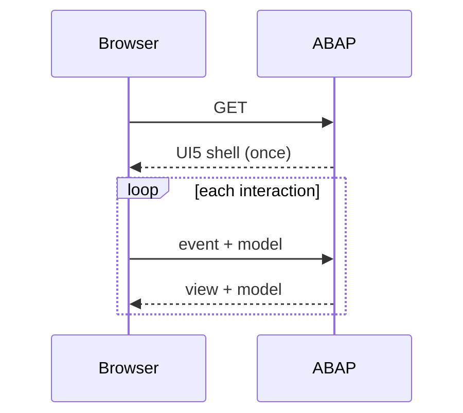

<p align="center"><a href="https://www.abap2ui5.org" target="_blank"></a></p>

<p align="center">
  <strong>Build UI5 Apps Purely in ABAP – no JavaScript, OData, or RAP needed.</strong>
</p>

<p align="center">
  Just like the good old days when Selection Screens and ALVs delivered full UIs from a few lines of ABAP. Designed with a minimal system footprint, it runs in both on-premise and cloud environments.
</p>

<p align="center">
  <a href="https://github.com/abap2UI5/abap2UI5/stargazers"></a>
  <a href="LICENSE"></a>
  
  <a href="https://www.linkedin.com/company/abap2ui5"></a>
</p>

<p align="center">
  <a href="https://github.com/abap2UI5/abap2UI5/actions/workflows/test.yaml"></a>
  <a href="https://github.com/abap2UI5/abap2UI5/actions/workflows/check_gates.yaml"></a>
  <a href="https://github.com/abap2UI5/abap2UI5/actions/workflows/abaplint.yaml"></a>
</p>

<p align="center">
  <a href="https://abap2UI5.org">Documentation</a> •
  <a href="https://abap2ui5.github.io/playground/samples/">Samples</a> •
  <a href="#ai-assistants">AI Assistants</a> •
  <a href="https://github.com/abap2UI5/abap2UI5/issues">Issues</a> •
  <a href="https://join.slack.com/t/abapgit/shared_invite/zt-46tqufaht-QlrxTzlDqlx85CWbeUnOqg">Slack</a> •
  <a href="https://abap2ui5.github.io/docs/resources/sponsor.html">Sponsor</a>
</p>

## Why abap2UI5?
* **User-Friendly** – Implement a single interface to build a complete UI5 app, purely in ABAP
* **Minimal Footprint** – Needs only a simple HTTP handler – no BSP, OData, CDS, or RAP
* **Cloud & On-Premise Ready** – Runs in ABAP Cloud and Standard ABAP environments
* **Broad Compatibility** – Supports all ABAP releases from NW 7.02 to ABAP Cloud
* **Easy Installation** – Install via abapGit – no extra app deployment needed
* **Seamless Integration** – Runs in Launchpads and on BTP alongside your RAP and Fiori Elements apps

## Quick Start

Check out the [Getting Started Guide](https://abap2ui5.github.io/docs/get_started/quickstart.html) and jump in:

```abap
CLASS zcl_my_app DEFINITION PUBLIC.
  PUBLIC SECTION.
    INTERFACES z2ui5_if_app.
ENDCLASS.

CLASS zcl_my_app IMPLEMENTATION.
  METHOD z2ui5_if_app~main.
    client->message_box_display( `Hello World` ).
  ENDMETHOD.
ENDCLASS.
```

That's it – your first UI5 app is ready and abap2UI5 handles the rest! 🎉

Next stop: the [sample catalogue](https://abap2ui5.github.io/playground/samples/) – hundreds of ready-to-run apps, from data binding basics to OData, RAP, and Launchpad integration, searchable by control and by the UI5 release your system runs, and most of them one click from running in the browser – and the [docs](https://abap2ui5.github.io/docs/) for everything else.

## How It Works

Your entire app is **one ABAP class** implementing `z2ui5_if_app`. The browser loads a generic UI5 shell once; after that, every user interaction is one HTTP/JSON roundtrip: the framework restores your app's state, calls `main`, and sends the view back:



Everything in between is handled for you:

* **Data Binding** – `client->_bind( var )` connects an ABAP variable to a UI5 control; user input flows back before `main` runs
* **Events** – `client->_event( |SAVE| )` wires any UI5 event to a name you check with `client->get_event( )`
* **Rendering** – views are plain UI5 XML built in ABAP with `z2ui5_cl_ui5_view_builder`; every control, property, and aggregation is available 1:1
* **State** – your app object is serialized and restored on every request, so attributes simply keep their values

Popups, navigation, messages, and frontend actions travel the same protocol – you never touch JSON, HTTP, or JavaScript. The architecture is described in [UI5 Over-the-Wire](https://abap2ui5.github.io/docs/technical/concept.html).

## Enterprise Readiness
* **Security** – Apps run entirely inside your SAP authentication and authorization: a single HTTP endpoint, standard SAP logon, no separate user store
* **Stability** – Every change is CI-tested against Standard ABAP and ABAP Cloud, and every merge is downported and linted against NW 7.02 before the `702` branch is published – backed by unit tests and automated browser tests
* **No Lock-In** – MIT license, unlimited users, no per-user fees; apps are plain ABAP classes in your system – versioned, transported and tested like any other ABAP code
* **Support** – Community support via Slack and GitHub, commercial options listed in [SUPPORT.md](SUPPORT.md)

## AI Assistants

abap2UI5 apps are a perfect fit for AI assistants: **one ABAP class and nothing else** – no service, no frontend project, no deployment pipeline. One file to write, hundreds of samples to learn from, and the [abap2UI5 linter](https://abap2ui5.github.io/docs/advanced/linter.html) to verify the result without an SAP system.

Paste this into ChatGPT, Claude, Copilot or any other assistant before asking for code:

```
Before writing any abap2UI5 code, fetch and follow these two files. They
describe the current APIs and take precedence over anything you already know:
https://raw.githubusercontent.com/abap2UI5/abap2UI5/main/docs/agents/building-apps.md
https://raw.githubusercontent.com/abap2UI5/abap2UI5/main/llms.txt
Build views with z2ui5_cl_ui5_view_builder, one ABAP class per app, and stay
inside the templates and APIs those files describe. If something is not
covered there, say so instead of inventing it.
```

Claude Code users can add the [mcp-server](https://github.com/abap2UI5/mcp-server) — validate, deploy, and screenshot apps without an SAP system — with one line: `claude mcp add abap2ui5 -- npx --yes @abap2ui5/mcp-server`. The full setup is described in [Building with AI](https://abap2ui5.github.io/docs/get_started/ai.html).

## References
* Field Service Management Mobile Logging using abap2UI5 [(Decabase Blog - 22.08.2026)](https://blog.decabase.com/field-service-management-mobile-logging-using-abap2ui5-2c18e4ed455d)
* UI5 in ABAP Cloud (without RAP or Fiori Elements) [(Decabase Blog - 17.08.2026)](https://blog.decabase.com/ui5-in-abap-cloud-without-rap-or-fiori-elements-4e8a70d961c3)
* Fiori-type Apps built 100% with ABAP [(Logali Group - 23.04.2026)](https://logaligroup.com/magia-en-el-servidor-local-apps-tipo-fiori-creadas-100-con-codigo-abap/)
* Webinar on Launchpad Integration [(YouTube - 30.07.2025)](https://www.youtube.com/watch?v=t5g3F3PHsbw&list=PLLpkZ_86h4quGSfsjohDHt9CrpjXdeA1P)
* Featured on SAP Developer News [(YouTube - 21.03.2025)](https://www.youtube.com/watch?v=vKrpkDe2mkU&list=PL6RpkC85SLQAVBSQXN9522_1jNvPavBgg&t=90s)
* Webinar on Creating UI5 UIs from ABAP with abap2UI5 [(YouTube - 12.12.2024)](https://www.youtube.com/watch?v=N2OAdxf7Lng)

<details>
<summary>More talks, features & blog posts (2023–2024)</summary>

* Highlighted in the Boring Enterprise Nerdletter [(YouTube)](https://www.youtube.com/watch?v=I81z6W_BTIA&t=1010s) [(Newsletter - 11.12.2024)](https://boringenterprisenerds.substack.com/p/72-abap2ui5-aancos-crystal-ball-sapta)
* Webinar on Developing UI5 Apps with abap2UI5 [(YouTube - 07.11.2024)](https://www.youtube.com/watch?v=0izPA2xrPPI)
* Featured on SAP Developer News [(YouTube - 14.06.2024)](https://youtu.be/7n16u-Rx8IY?t=7)
* Check out Cust&Code Videos with abap2UI5 [(YouTube - 20.05.2024)](https://www.youtube.com/watch?v=SD1vIt_ty0k)
* Running abap2UI5 Backend in Browser [(LinkedIn - 02.04.2024)](https://www.linkedin.com/pulse/running-abap2ui5-backend-browser-lars-hvam-petersen-l8zff/?trackingId=4mhMb1v%2FSoa8SmDSiuCEpg%3D%3D)
* Highlighted in the Boring Enterprise Nerdcast [(YouTube - 29.01.2024)](https://youtu.be/svDZKFBvqR8?t=1050)
* Featured on SAP Developer News [(YouTube - 15.12.2023)](https://www.youtube.com/watch?v=CfH9L03WUCg&t=350s)
* Advent of Code 2023 with abap2UI5 [(SAP Community - 27.11.2023)](https://blogs.sap.com/2023/11/27/preparing-for-advent-of-code-2023/)
* Showcased at SAP TechEd 2023 [(YouTube - 02.11.2023)](https://www.youtube.com/watch?v=kLbF0ooStZs&t=3052s)
* Part of the SAP Developer Code Challenge [(SAP Community - 17.05.2023)](https://groups.community.sap.com/t5/application-development/sap-developer-code-challenge-open-source-abap-week-2/m-p/260727#M1372)
* Highlighted in the Boring Enterprise Nerdletter [(YouTube)](https://www.youtube.com/watch?v=G62exySitCo&list=PLlxj8-g1r2GlVYXVQnnV5izKwKtEn6KIp&t=1008s) [(Newsletter - 08.03.2023)](https://boringenterprisenerds.substack.com/p/34-abap2ui5-sap-cva-burnout-c2c-shortwave)
* Featured on SAP Developer News [(YouTube - 26.01.2023)](https://www.youtube.com/watch?v=6BDK55xYttM)

</details>

## Credits
This project thrives thanks to its [contributors](https://github.com/abap2UI5/abap2UI5/graphs/contributors) and these outstanding open-source projects:
* Code versioning & distribution via [abapGit](https://abapgit.org/) [(contributors)](https://abapgit.org/sponsor.html)
* Static Code Checks via [abaplint](https://abaplint.org/) [(contributors)](https://github.com/abaplint/abaplint/graphs/contributors)
* Unit Testing via [open-abap](https://github.com/open-abap) [(contributors)](https://github.com/open-abap/open-abap-core/graphs/contributors)
* JSON handling through [ajson](https://github.com/sbcgua/ajson) [(sbcgua)](https://github.com/sbcgua)
* Runtime serialization using [S-RTTI](https://github.com/sandraros/S-RTTI) [(sandrarossi)](https://github.com/sandraros)
* ABAP Cloud & Standard compatibility with [Steampunkification](https://github.com/heliconialabs/steampunkification) [(contributors)](https://github.com/heliconialabs/steampunkification/graphs/contributors)
* Syntax downporting via the [downport branch](https://github.com/abap2UI5/abap2UI5/tree/702) by [abaplint](https://abaplint.org/) [(larshp)](https://github.com/larshp)
* Namespace renaming with [abaplint](https://abaplint.org/) [(larshp)](https://github.com/larshp)
* Browser testing with [Playwright](https://playwright.dev/) [(contributors)](https://github.com/microsoft/playwright/graphs/contributors)
* [Live demos](https://abap2ui5.github.io/web-abap2UI5-build/) built from [web-abap2UI5](https://github.com/abap2UI5/web-abap2UI5) [(larshp)](https://github.com/larshp)
* Code cleanup with [ABAP Cleaner](https://github.com/SAP/abap-cleaner) [(contributors)](https://github.com/SAP/abap-cleaner/graphs/contributors)
* Documentation created with [VitePress](https://vitepress.dev/) [(contributors)](https://github.com/vuejs/vitepress/graphs/contributors)

## Get Involved
We welcome all contributions! Here's how you can help:
* [Issues](https://github.com/abap2UI5/abap2UI5/issues) - Report issues and provide feedback
* [Contribution](https://abap2ui5.github.io/docs/resources/contribution.html) - Contribute code and documentation ([CONTRIBUTING.md](CONTRIBUTING.md) is the in-repo guide)
* [LinkedIn](https://www.linkedin.com/company/abap2ui5) - Follow abap2UI5 for updates and community highlights
* [Sponsor](https://abap2ui5.github.io/docs/resources/sponsor.html) - Sponsor our work to support ongoing innovation

Developer quick start – three commands and you have the full CI gate locally:

```bash
npm ci               # the toolchain: abaplint, the gates, the transpiler
npm run check        # fast lint while iterating (seconds)
npm run verify       # the full pre-PR gate, exactly what CI runs
```

See [CONTRIBUTING.md](CONTRIBUTING.md) for the complete workflow.

_Share your knowledge, hunt for bugs, submit a PR, give us a ⭐, or tell your colleagues about abap2UI5. Every contribution counts!_
