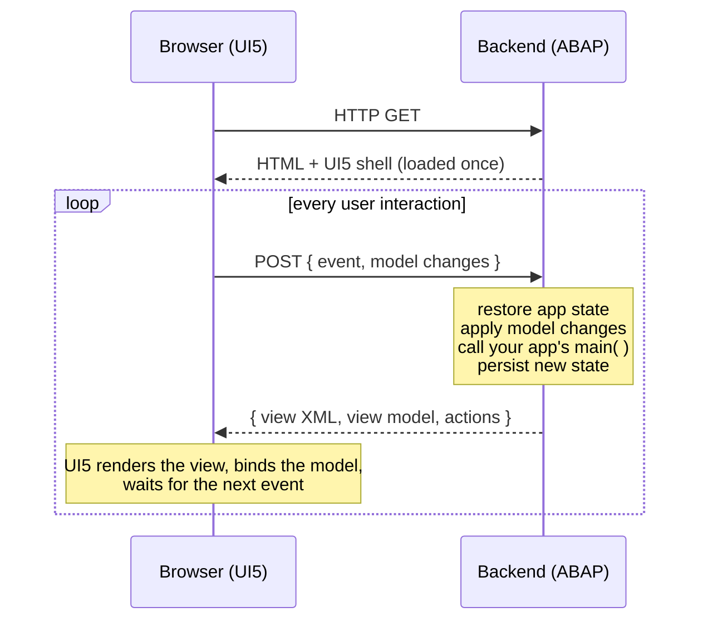

<p align="center"><a href="https://www.abap2ui5.org" target="_blank"></a></p>

<p align="center">
  <strong>Build UI5 Apps Purely in ABAP – no JavaScript, OData, or RAP needed.</strong>
</p>

<p align="center">
  Just like the good old days when Selection Screens and ALVs delivered full UIs from a few lines of ABAP. Designed with a minimal system footprint, it runs in both on-premise and cloud environments.
</p>

<p align="center">
  <a href="https://github.com/abap2UI5/abap2UI5/stargazers"></a>
  <a href="LICENSE"></a>
  
</p>

<p align="center">
  <a href="https://abap2UI5.org">Documentation</a> •
  <a href="#learn-abap2ui5">Samples</a> •
  <a href="https://github.com/abap2UI5/abap2UI5/issues">Issues</a> •
  <a href="https://www.linkedin.com/company/abap2ui5">LinkedIn</a> •
  <a href="https://join.slack.com/t/abapgit/shared_invite/zt-46tqufaht-QlrxTzlDqlx85CWbeUnOqg">Slack</a> •
  <a href="https://abap2ui5.github.io/docs/resources/sponsor.html">Sponsor</a>
</p>

#### Key Features
* **User-Friendly** – Implement a single interface to build a complete UI5 app, purely in ABAP
* **Minimal Footprint** – Needs only a simple HTTP handler – no BSP, OData, CDS, or RAP
* **Cloud & On-Premise Ready** – Runs in ABAP Cloud and Standard ABAP environments
* **Broad Compatibility** – Supports all ABAP releases from NW 7.02 to ABAP Cloud
* **Easy Installation** – Install via abapGit – no extra app deployment needed


#### Quick Start

Ready to build your first app? Check out the [Getting Started Guide](https://abap2ui5.github.io/docs/get_started/quickstart.html) and jump in with the following code:

```abap
CLASS zcl_my_app DEFINITION PUBLIC.
  PUBLIC SECTION.
    INTERFACES z2ui5_if_app.
ENDCLASS.

CLASS zcl_my_app IMPLEMENTATION.
  METHOD z2ui5_if_app~main.
    client->message_box_display( `Hello World` ).
  ENDMETHOD.
ENDCLASS.
```

That's it – your first UI5 app is ready and abap2UI5 handles the rest! 🎉

#### How It Works

Your entire app is **one ABAP class** implementing `z2ui5_if_app`. The framework calls its `main` method on every roundtrip – once at startup and once per user interaction – and your app decides what happens:

```abap
METHOD z2ui5_if_app~main.
  IF client->check_on_init( ).
    view_display( ).   " app start – build a UI5 XML view, bind ABAP variables into it
  ELSEIF client->check_on_navigated( ).
    view_display( ).   " back from a called app or a popup – put this app's view back
  ELSEIF client->check_on_event( ).
    on_event( ).       " user interaction – bound data already contains the user's input
  ENDIF.
ENDMETHOD.
```

All three branches belong to the dispatcher. `check_on_init( )` fires once per
app instance, so it is *not* reached again when another app hands control back
(`nav_app_leave`, a `z2ui5_cl_pop_*` value help) or when a bookmarked state is
restored – those roundtrips fire `check_on_navigated( )`. Without that branch
the browser keeps showing whatever was on screen before, with no error
anywhere.

Under the hood, abap2UI5 is a **single-page app**: the browser loads a generic UI5 shell once, then every user interaction becomes one HTTP/JSON roundtrip to ABAP:



Between roundtrips the framework does all the plumbing you would otherwise write yourself:

* **Data Binding** – `client->_bind( var )` connects an ABAP variable to a UI5 control; user input is written back into the variable before `main` runs, and changes travel as deltas
* **Events** – `client->_event( |SAVE| )` wires any UI5 event to a name you check in ABAP with `client->get_event( )`
* **Rendering** – views are plain UI5 XML built in ABAP with the view builder `z2ui5_cl_ui5_view_builder`; every UI5 control, property, and aggregation is available 1:1
* **State** – your app object is serialized to a draft table and restored on the next request, so attributes simply keep their values between interactions

The same protocol also carries popups, navigation, messages, and frontend actions – you never touch JSON, HTTP, or JavaScript yourself.

#### Learn abap2UI5

Three sample repositories accompany the framework. They build on each other – from the first app to full-stack integration:

| Repository | Content |
|------------|---------|
| [samples](https://github.com/abap2UI5/samples) | Fundamentals – data binding, events, popups, navigation, and complete example apps |
| [samples-controls](https://github.com/abap2UI5/samples-controls) | The full UI5 control set – the UI5 Demo Kit rebuilt with abap2UI5 |
| [samples-stack](https://github.com/abap2UI5/samples-stack) | Integration scenarios – OData, RAP, WebSockets, and the Fiori Launchpad |

All samples are ready to run – install them with abapGit and explore the source code.

#### References
* Fiori-type Apps built 100% with ABAP [(Logali Group - 23.04.2026)](https://logaligroup.com/magia-en-el-servidor-local-apps-tipo-fiori-creadas-100-con-codigo-abap/)
* Webinar on Launchpad Integration [(YouTube - 30.07.2025)](https://www.youtube.com/watch?v=t5g3F3PHsbw&list=PLLpkZ_86h4quGSfsjohDHt9CrpjXdeA1P)
* Featured on SAP Developer News [(YouTube - 21.03.2025)](https://www.youtube.com/watch?v=vKrpkDe2mkU&list=PL6RpkC85SLQAVBSQXN9522_1jNvPavBgg&t=90s)
* Webinar on Creating UI5 UIs from ABAP with abap2UI5 [(YouTube - 12.12.2024)](https://www.youtube.com/watch?v=N2OAdxf7Lng)
* Webinar on Developing UI5 Apps with abap2UI5 [(YouTube - 07.11.2024)](https://www.youtube.com/watch?v=0izPA2xrPPI)

<details>
<summary>More talks, features & blog posts (2023–2024)</summary>

* Highlighted in the Boring Enterprise Nerdletter [(YouTube)](https://www.youtube.com/watch?v=I81z6W_BTIA&t=1010s) [(Newsletter - 11.12.2024)](https://boringenterprisenerds.substack.com/p/72-abap2ui5-aancos-crystal-ball-sapta)
* Featured on SAP Developer News [(YouTube - 14.06.2024)](https://youtu.be/7n16u-Rx8IY?t=7)
* Check out Cust&Code Videos with abap2UI5 [(YouTube - 20.05.2024)](https://www.youtube.com/watch?v=SD1vIt_ty0k)
* Running abap2UI5 Backend in Browser [(LinkedIn - 02.04.2024)](https://www.linkedin.com/pulse/running-abap2ui5-backend-browser-lars-hvam-petersen-l8zff/?trackingId=4mhMb1v%2FSoa8SmDSiuCEpg%3D%3D)
* Highlighted in the Boring Enterprise Nerdcast [(YouTube - 29.01.2024)](https://youtu.be/svDZKFBvqR8?t=1050)
* Featured on SAP Developer News [(YouTube - 15.12.2023)](https://www.youtube.com/watch?v=CfH9L03WUCg&t=350s)
* Advent of Code 2023 with abap2UI5 [(SAP Community - 27.11.2023)](https://blogs.sap.com/2023/11/27/preparing-for-advent-of-code-2023/)
* Showcased at SAP TechEd 2023 [(YouTube - 02.11.2023)](https://www.youtube.com/watch?v=kLbF0ooStZs&t=3052s)
* Part of the SAP Developer Code Challenge [(SAP Community - 17.05.2023)](https://groups.community.sap.com/t5/application-development/sap-developer-code-challenge-open-source-abap-week-2/m-p/260727#M1372)
* Highlighted in the Boring Enterprise Nerdletter [(YouTube)](https://www.youtube.com/watch?v=G62exySitCo&list=PLlxj8-g1r2GlVYXVQnnV5izKwKtEn6KIp&t=1008s) [(Newsletter - 08.03.2023)](https://boringenterprisenerds.substack.com/p/34-abap2ui5-sap-cva-burnout-c2c-shortwave)
* Featured on SAP Developer News [(YouTube - 26.01.2023)](https://www.youtube.com/watch?v=6BDK55xYttM)

</details>

#### Credits
This project thrives thanks to its [contributors](https://github.com/abap2UI5/abap2UI5/graphs/contributors) and these outstanding open-source projects:
* Code versioning & distribution via [abapGit](https://abapgit.org/) [(contributors)](https://abapgit.org/sponsor.html)
* Static Code Checks via [abaplint](https://abaplint.org/) [(contributors)](https://github.com/abaplint/abaplint/graphs/contributors)
* Unit Testing via [open-abap](https://github.com/open-abap) [(contributors)](https://github.com/open-abap/open-abap-core/graphs/contributors)
* JSON handling through [ajson](https://github.com/sbcgua/ajson) [(sbcgua)](https://github.com/sbcgua)
* Runtime serialization using [S-RTTI](https://github.com/sandraros/S-RTTI) [(sandrarossi)](https://github.com/sandraros)
* ABAP Cloud & Standard compatibility with [Steampunkification](https://github.com/heliconialabs/steampunkification) [(contributors)](https://github.com/heliconialabs/steampunkification/graphs/contributors)
* Syntax downporting via the [downport branch](https://github.com/abap2UI5/abap2UI5/tree/702) by [abaplint](https://abaplint.org/) [(larshp)](https://github.com/larshp)
* Namespace renaming with [abaplint](https://abaplint.org/) [(larshp)](https://github.com/larshp)
* Browser testing with [Playwright](https://playwright.dev/) [(contributors)](https://github.com/microsoft/playwright/graphs/contributors)
* Live demos running via [web-abap2ui5-samples](https://github.com/abap2UI5/web-abap2ui5-samples) [(larshp)](https://github.com/larshp)
* Code cleanup with [ABAP Cleaner](https://github.com/SAP/abap-cleaner) [(contributors)](https://github.com/SAP/abap-cleaner/graphs/contributors)
* Documentation created with [VitePress](https://vitepress.dev/) [(contributors)](https://github.com/vuejs/vitepress/graphs/contributors)

#### AI Assistants

Almost everything ever published about abap2UI5 shows `z2ui5_cl_xml_view`, the
view builder that has since been frozen. A model asked cold will write that —
it compiles and it renders, so nothing complains. **Give it the current
sources first.** Paste this ahead of your task:

```text
Before writing any abap2UI5 code, read https://abap2ui5.github.io/docs/llms.txt
and follow it to the pages you need.

Four things that override whatever you remember about abap2UI5:
1. An app is ONE ABAP class implementing z2ui5_if_app. Everything enters main( ),
   which dispatches on client->check_on_init( ), client->check_on_event( `X` ) and
   client->check_on_navigated( ).
2. Build the view with z2ui5_cl_ui5_view_builder and its verbs ele / tag / a / end /
   stringify. z2ui5_cl_xml_view is the FROZEN predecessor - it is what most examples
   online show, and it is not what to write.
3. Bind with client->_bind( ). It is bidirectional; only what the user edited comes back.
4. Every roundtrip is a fresh ABAP session. Nothing survives on the server except
   the app class itself, which is serialized.

Before building something from scratch, check whether it exists: 152 complete apps
are listed with search terms at
https://github.com/abap2UI5/samples/blob/main/SAMPLES.md

When you are done, check the result with the abap2UI5-linter
(npx abap2ui5lint) - it reads the view your ABAP builds and needs no SAP system.
```

Then, depending on how much setup you want:

| | |
|---|---|
| [llms.txt](https://abap2ui5.github.io/docs/llms.txt) | the documentation as a map, one fetch. [llms-full.txt](https://abap2ui5.github.io/docs/llms-full.txt) is all of it in one document, and every page is served as raw markdown next to its `.html` |
| [ai-mcp](https://github.com/abap2UI5/ai-mcp) | MCP server: query the sample catalogue, validate a view, deploy, build, boot the app headless and **look at a screenshot**. No SAP system. This is the setup that closes the loop |
| [app-template](https://github.com/abap2UI5/app-template) | start a project here — both gates, CI and an `AGENTS.md` for your own repo, already wired up |
| [linter](https://github.com/abap2UI5/linter) | the check to run on generated code. It reports a class written on the frozen builder, which is the most common thing a model gets wrong |
| [docs/agents/building-apps.md](docs/agents/building-apps.md) | self-contained offline guide for **building apps**, when fetching is not an option |
| [AGENTS.md](AGENTS.md) · [llms.txt](llms.txt) | for work **on the framework itself** — architecture, layering, coding rules, and a map of the code |

#### Get Involved
We welcome all contributions! Here's how you can help:
* [Issues](https://github.com/abap2UI5/abap2UI5/issues) - Report issues and provide feedback
* [Contribution](https://abap2ui5.github.io/docs/resources/contribution.html) - Contribute code and documentation
* [LinkedIn](https://www.linkedin.com/company/abap2ui5) - Follow abap2UI5 for updates and community highlights
* [Sponsor](https://abap2ui5.github.io/docs/resources/sponsor.html) - Sponsor our work to support ongoing innovation

_Share your knowledge, hunt for bugs, submit a PR, give us a ⭐, or tell your colleagues about abap2UI5. Every contribution counts!_
